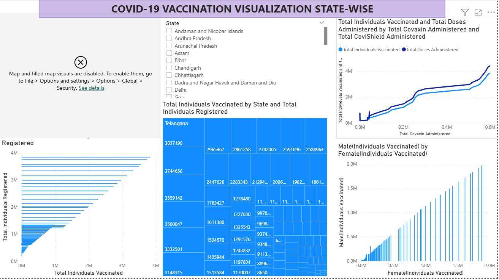

# PowerBI-Covid19-Dashboard
This project is a Power BI dashboard that analyzes Covid-19 vaccination data. It provides insights into vaccination trends, region-wise performance, and time-based analysis using interactive visualizations.

🔹 Tools Used:
- Power BI

🔹 Key Insights:
- Vaccination trends over time
- Region-wise performance
- Comparative analysis

🔹 File:
- Covid-19 Vaccination Dashboard.pbix

## 📊 Dashboard Preview:

